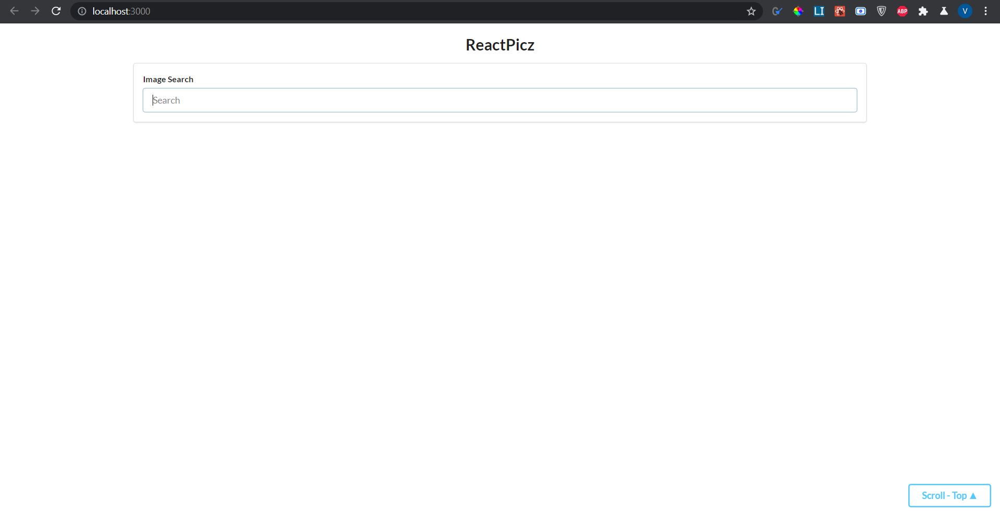
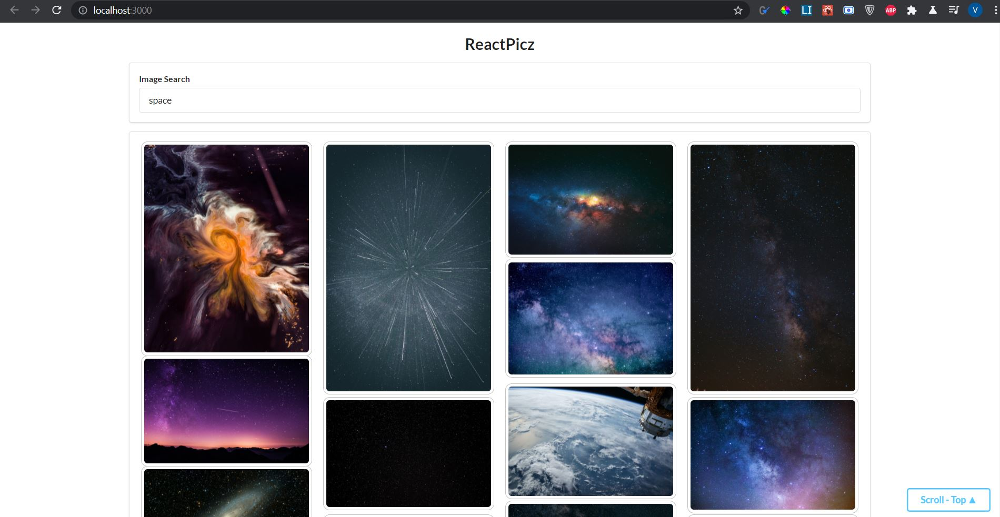
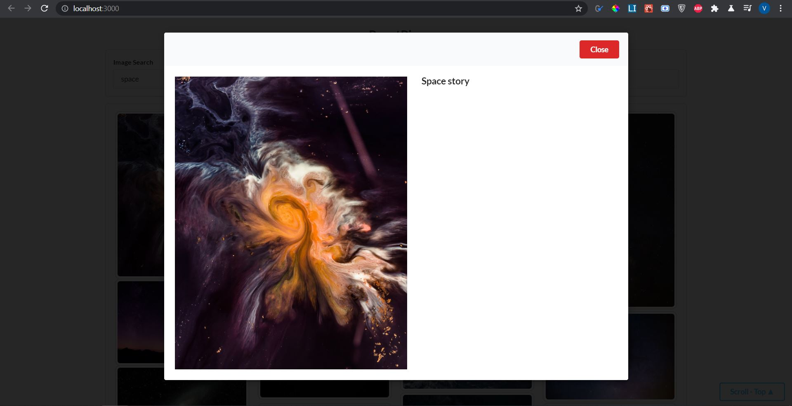

# **ReactPicz**

ReactPicz is a single page web-application that uses Unsplash API to fetch images and display them with a grid based system.

ReactPicz was made up using the basic concepts of states, props, components and other basic React concepts. 

In addition to that ReactPicz also uses axios library to make an ajax call to the API.

## Getting Started

To install the dependencies In the project directory run:

### `npm i`

To start the application, run:

### `npm start`

Hence, the application would start at [http://localhost:3000] 

### `Note: Make sure to generate your own Unsplash API Key and place it in unsplash.js component/api Directory.`

## Snapshots

Before Fetching:

After Fetching:

On clicking images:

